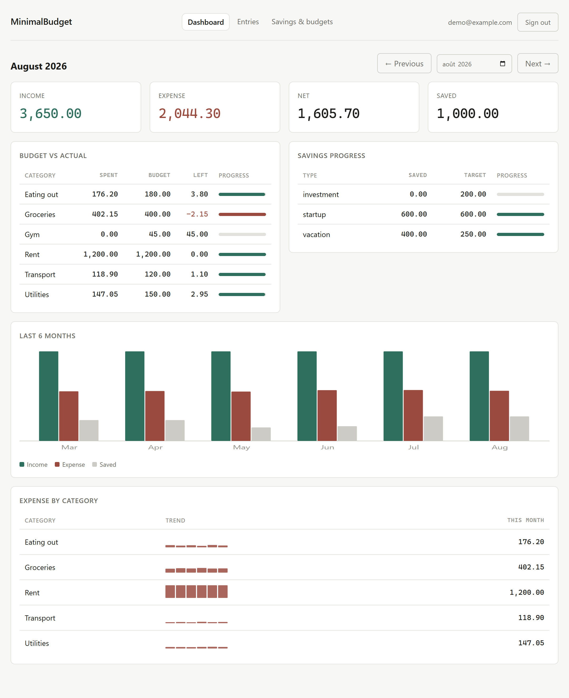

# MinimalBudget

A small personal finance tracker. Manual entry, no bank linking, one question:
**did I earn, spend and save what I meant to this month?**



Per-user isolation is enforced by Postgres row-level security, and is proven by tests that run
queries as a second user rather than by reading a policy and believing it.

---

## What it does

- Record **income** and **expense** entries — amount, category, date, optional note. Typing a
  category that does not exist yet creates it.
- Record **savings contributions** against savings types (`startup`, `vacation` and `investment`
  are seeded; add your own).
- Set a **standing monthly budget** per expense category and a **monthly target** per savings type.
- Change your password, and generate one-time **recovery codes** so a forgotten password is not a
  trip to the operator.
- Describe what **recurs** — rent, salary, the electricity bill — once. On its due date it is
  proposed for confirmation, with the amount editable; only a template you mark "add
  automatically" writes an entry on its own.
- A **dashboard** for any month: income, expense, net and saved; budget versus actual per category;
  savings progress per type; and six months of trend, with a small multiple per category.
- An expense can carry a **quantity and unit** — `$60.14` for `40.123 l` — and the app derives the
  **price per unit** and charts it by month on the category page. Units are a closed list
  (`l gal kg lb kwh m3 unit`); nothing is converted between them. The entry form takes any two of
  amount, quantity and unit price and fills in the third.
- **Stock**: user-defined spaces (Fridge, Garage, House stuff…) holding items with a whole-number
  quantity, an optional cost, a note, and an optional restock threshold. "Needs restocking" is a
  predicate over quantity and threshold, computed in SQL, never a stored flag. The dashboard shows
  "N items need restocking"; every quantity change is logged, and each item has a quantity-over-time
  chart. The inventory never writes to the ledger and the ledger never writes to it.

### Not in v1

Bank sync, recurring transactions, multi-currency, CSV export, native mobile, and self-service
password reset (there is an operator command instead — see below). A React Native client reusing
this same API is the v2 plan, which is why the API is plain JSON with bearer tokens and no cookie
or template coupling.

---

## Stack

| | |
| --- | --- |
| Frontend | React 19, TypeScript 7, Vite 8, hand-rolled SVG charts (no chart library) |
| Backend | FastAPI, SQLAlchemy 2, Alembic, Python 3.13 |
| Database | Postgres 18, row-level security enabled **and forced** on every table |
| Auth | Argon2id password hashing, short-lived HS256 JWT, rotating refresh tokens |
| Config | Environment variables only. No provider SDKs — the build is host-agnostic. |
| Production | Caddy, with automatic Let's Encrypt certificates |

---

## Running it

You need Docker, Python 3.13 and Node 22.

```bash
cp .env.example .env
```

Fill in `.env`. Every password and `SECRET_KEY` needs a real value — nothing has a working
default, and the API refuses to start without them. Generate the secret with:

```bash
python -c "import secrets; print(secrets.token_urlsafe(48))"
```

Start Postgres. The first boot creates both database roles from your `.env`:

```bash
docker compose up -d db
```

Install and migrate the backend. Migrations run as the **owner** role; the API runs as a separate
unprivileged one:

```bash
cd backend && python -m venv .venv && ./.venv/Scripts/python.exe -m pip install -e ".[dev]"
```

```bash
cd backend && ./.venv/Scripts/python.exe -m alembic upgrade head
```

Optionally load a demo account with six months of plausible data. It refuses to run without
`ALLOW_SEED=1`, because it creates an account whose password is printed below — harmless on a
laptop, a handed-out login on a server:

```bash
cd backend && ALLOW_SEED=1 ./.venv/Scripts/python.exe seed.py
```

Run the API:

```bash
cd backend && ./.venv/Scripts/python.exe -m uvicorn app.main:app --reload
```

And the client, in another terminal — it proxies `/api` to the backend in development:

```bash
cd frontend && npm install && npm run dev
```

Then open <http://localhost:5173>. If you seeded, sign in as `demo@example.com` /
`demo-password-1234`.

On macOS or Linux the venv binary is `.venv/bin/python` rather than `.venv/Scripts/python.exe`.

---

## Tests

```bash
cd backend && ./.venv/Scripts/python.exe -m pytest -q
```

```bash
cd frontend && npm test
```

The backend suite runs against **real Postgres** on a throwaway database it creates and drops per
run. There is deliberately no SQLite path: SQLite has no row-level security, so every isolation
assertion would pass against it while proving nothing.

---

## Running it for real, on the internet

The stack above is for development. `docker-compose.prod.yml` is the one to deploy: Caddy
terminates TLS and serves the built client, the API and Postgres are reachable only on the
internal network, and migrations run as a separate step so the API image never holds the owner
credentials.

Certificates are obtained and renewed automatically. There is no certbot, no cron, and no
provider SDK — any machine with Docker and a domain pointed at it will do.

### Deploying

Point an A record at the machine, then on it:

```bash
cp .env.example .env
```

Fill in every value. `DOMAIN` and `ACME_EMAIL` are only used in production; the certificate
directive will not parse without the email. Generate the secret and the three passwords with:

```bash
python -c "import secrets; print(secrets.token_urlsafe(48))"
```

```bash
docker compose -f docker-compose.prod.yml up -d --build
```

That brings up Postgres, runs the migrations, starts the API, and gets a certificate. Watch it
with `docker compose -f docker-compose.prod.yml logs -f web`.

**Registration is invite-only in production**, and that is hardcoded rather than read from `.env`.
Compose reads `.env` for variable substitution, so a `REGISTRATION_MODE=open` left over from local
development would otherwise become the production setting and leave the instance open to anyone
who finds the URL. Opening it is a deliberate edit to `docker-compose.prod.yml`.

### Installing it on a phone

It is a progressive web app, so there is no app store and no APK. Send the address, and:

- **iPhone/iPad** — open it in **Safari** (not Chrome; only Safari can install on iOS), tap
  Share, then *Add to Home Screen*.
- **Android** — open it in Chrome and accept the *Install app* prompt, or use *Add to Home
  screen* from the menu.

It then launches full-screen with its own icon, like any other app. Updates arrive on next
launch — nobody has to reinstall anything.

Offline, the app shell loads and tells you it cannot reach the server. It deliberately does not
cache your financial data: a stale balance shown as current is worse than an honest error, and a
cache would outlive the sign-out meant to clear it.

### Inviting your family

```bash
docker compose -f docker-compose.prod.yml run --rm migrate python invite.py new --note "sam" --days 14
```

The code is printed once and stored only as a hash; there is no way to recover it, so issue
another if it is lost. Send it over something private — anyone holding it can create one account.
`invite.py list` shows what has been issued and whether it was used.

### When someone forgets their password

Each person can generate eight one-time **recovery codes** on the Settings page (it asks for the
current password first) and should keep them somewhere that is not the app. "Forgot your
password?" on the sign-in page takes their email, one unused code and a new password; the code
is spent and every session is signed out. No email is involved.

If the codes are lost as well (or were never generated), the operator can issue one. Confirm who
is asking through some channel that is not the app, then:

```bash
docker compose -f docker-compose.prod.yml run --rm migrate python recovery.py issue sam@example.com
```

The code is printed once; the person uses it on the sign-in page and chooses the new password
themselves, so the operator never picks or learns one. `reset_password.py` still exists for the
case where that is not workable:

```bash
docker compose -f docker-compose.prod.yml run --rm migrate python reset_password.py sam@example.com
```

It prompts for the new password and revokes every active session for that account at the same
time. If the reason for the reset is that somebody else got in, leaving their session alive would
defeat the point.

### Backups

```bash
./ops/backup.sh
```

Writes a timestamped, compressed dump and prunes past `RETENTION_DAYS` (30 by default). Put it on
a schedule — `0 3 * * * cd /srv/minimalbudget && ./ops/backup.sh` — and then **copy the output off
the machine**. A backup on the same disk as the database survives a mistake and does not survive
the disk dying. That is the step people skip.

Restoring, into a scratch database, which is how you check that the backups are real:

```bash
./ops/restore.sh backups/minimalbudget-20260830-030000Z.dump minimalbudget_verify
```

Without a target database it restores over the live one and asks you to type its name first.

Both scripts run as the Postgres superuser, and there is a reason worth knowing before you
"fix" it. Every table has `FORCE ROW LEVEL SECURITY`, so policies apply even to the schema owner,
and `pg_dump` sets `row_security=off` — which does not bypass RLS but raises an error if a policy
would filter the output, precisely so a backup cannot come out quietly incomplete. Dumping as the
owner therefore fails. The tempting fix is `--enable-row-security`, which dumps only currently
visible rows and would silently start losing data the day a policy changed.

### What this does not have

Stated plainly, because an internet-facing service deserves an honest list:

- **No email.** No verification, no self-service password reset, no alerts.
- **The login rate limiter is in-process.** It resets when the API restarts and each replica keeps
  its own counters. Fine for one container; not a distributed limiter.
- **No audit log.** You cannot see who signed in when.
- **Backups are not automatic.** The script exists; scheduling and copying it off the machine are
  yours to arrange.
- **One machine.** No replication and no failover. If it dies, you restore from a backup.

---

## How the isolation actually works

This is the part of the project worth reading the code for. Four decisions carry it, and each one
exists because the obvious alternative fails in a specific way.

**The database is the authority, not the application.** Every user-scoped table has
`ENABLE ROW LEVEL SECURITY` *and* `FORCE ROW LEVEL SECURITY`. Application-level `WHERE user_id`
filters are defence in depth; they are never the only thing between two users. A schema test walks
every table and fails if one is missing its policies, so a new table cannot ship unprotected.

**The app connects as a role that cannot bypass its own policies.** Migrations run as the schema
owner; the API connects as an unprivileged role with DML only, no DDL and no `BYPASSRLS`. `FORCE`
matters because the owner would otherwise skip the very policies it just installed. The runtime
role holds `INSERT` but not `SELECT` on `users.password_hash` — it can write a hash and can never
read one back.

**Tenancy is set once per request, through a bound parameter.**

```python
SELECT set_config('app.user_id', :uid, true)
```

`SET LOCAL` is forbidden in this codebase, and a test enforces that. It takes no bind parameter,
so using it would push you toward interpolating a JWT claim into SQL. The `sub` claim is parsed as
a UUID before it can reach this call. Only the session dependency commits — a `commit()` inside a
service would end the transaction and silently discard the tenant, after which every query returns
nothing and the endpoint answers `200` with empty data.

**Foreign keys carry `user_id`, because RLS does not cover them.** From the Postgres manual:
referential integrity checks *always* bypass row security. So a plain `category_id` foreign key
would let user B create an entry pointing at user A's category: B learns the id exists, and A can
never delete that category again. Every foreign key between user-scoped tables is composite and
includes `user_id`, so the database refuses the reference outright.

Each of these is covered by a test that was **watched fail**. Weakening the policy to
`USING (true)` turns eight tests red; reducing that foreign key to a single column turns the
cross-user reference test red. Green tests that have never failed are decoration.

`docs/architecture.md` has the full set of decisions, each with what it binds and which divergence
it prevents.

---

## Layout

```text
backend/
  app/api/         routers — routing and status codes, no SQL
  app/services/    business rules and the aggregation queries
  app/models/      SQLAlchemy entities
  app/core/        settings, security, the session dependency
  migrations/      schema, RLS policies, grants
  tests/
frontend/
  src/api/         the single typed client — nothing else calls fetch
  src/pages/
  src/charts/      inline SVG
ops/               Caddyfile, the web image, backup and restore
docs/              brief, PRD, architecture, epics
```

Operator commands live in `backend/`: `invite.py` issues registration codes, `reset_password.py`
sets a password and revokes that account's sessions, and `seed.py` populates a demo account. All
three need the owner credentials — the API's runtime role cannot mint an invite or read a
password hash.

---

## Licence

MIT. See [LICENSE](LICENSE).
