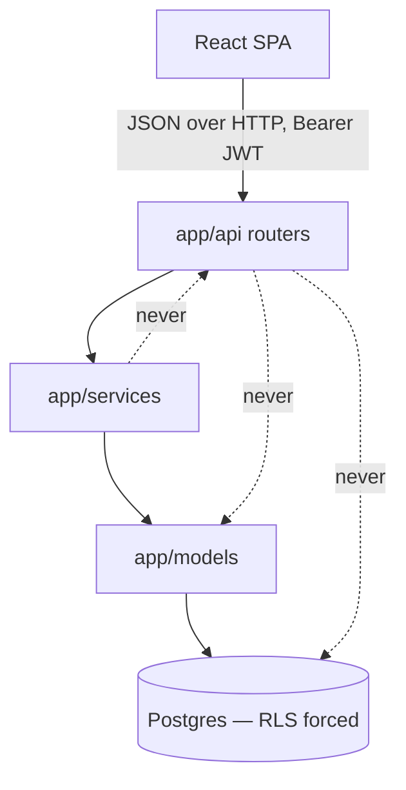
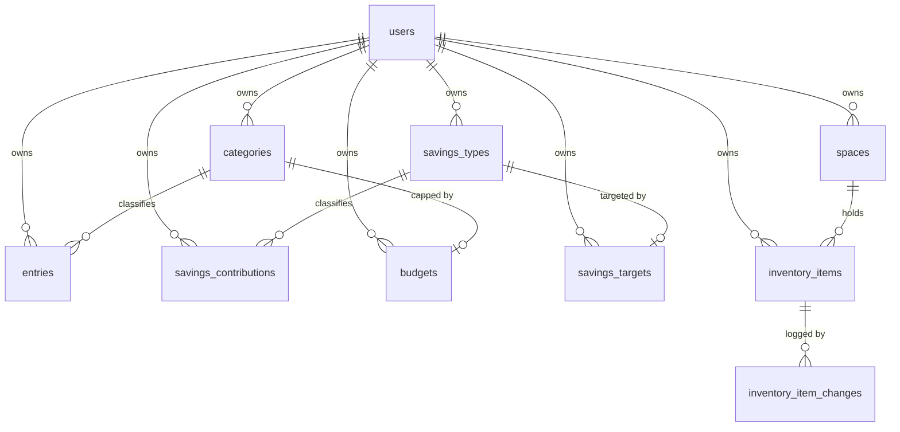
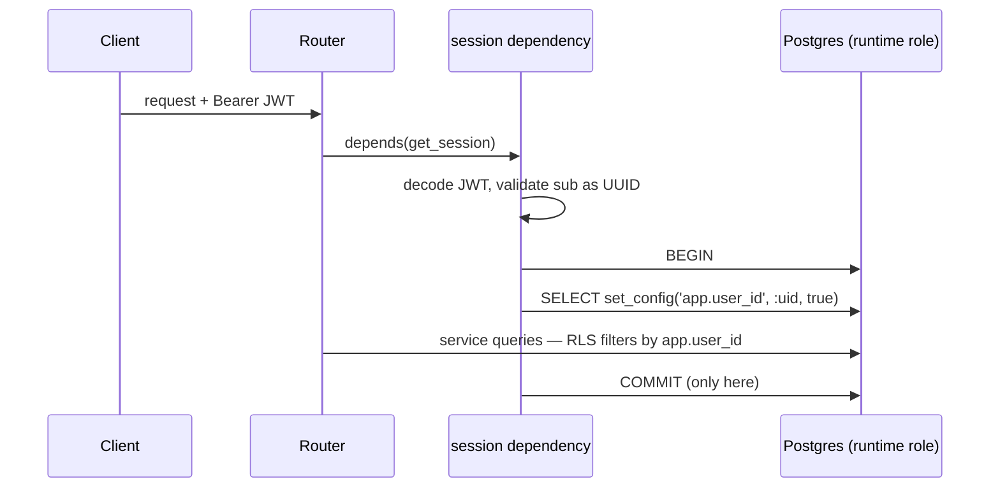
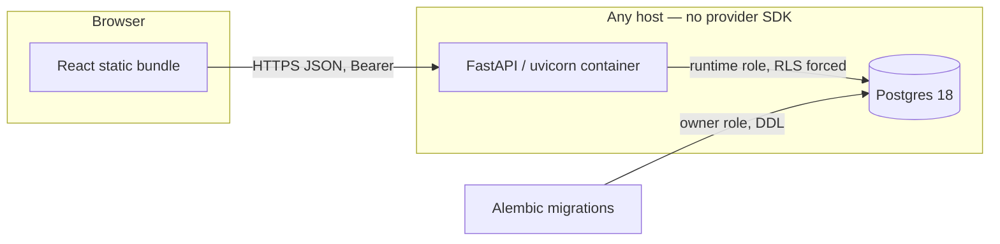

# Architecture Spine — MinimalBudget

## Design Paradigm

Layered service application. Three backend layers, one direction of dependency, plus a database
layer that is not merely storage but the **authority on data isolation**.

| Layer | Package | Owns |
| --- | --- | --- |
| HTTP | `app/api/` | Routing, request/response schemas, status codes. No SQL, no business rules. |
| Service | `app/services/` | Business rules, aggregation queries. |
| Model | `app/models/` | SQLAlchemy ORM entities and their constraints. |
| Database | `migrations/` | Schema, CHECK constraints, grants, and the RLS policies that enforce isolation. |



Dependencies point downward only. A router may not import a model; a service may not import a
router; nothing below the HTTP layer knows a request exists.

## Invariants & Rules

### AD-1 — Postgres RLS is the isolation authority

- **Binds:** all
- **Prevents:** one slice enforcing tenancy with `WHERE user_id = ?` and another forgetting to,
  producing a cross-user leak that no test of the second slice would catch.
- **Rule:** every user-scoped table carries a non-null `user_id` and has both `ENABLE ROW LEVEL
  SECURITY` and `FORCE ROW LEVEL SECURITY`, with `USING` and `WITH CHECK` policies covering all
  four commands. Application-level `WHERE user_id` filters are defence in depth and are never the
  only thing standing between two users. The obligation is mechanised by AD-24, not left to
  discipline.

### AD-2 — Two database roles, and the runtime role is not the owner

- **Binds:** all
- **Prevents:** the application connecting as the schema owner, which silently bypasses the very
  policies AD-1 installs.
- **Rule:** the owner role owns the schema and runs Alembic migrations. The runtime role has
  `SELECT, INSERT, UPDATE, DELETE` on user-scoped tables, `EXECUTE` on the function named in
  AD-19, no DDL, and no `BYPASSRLS`. `FORCE ROW LEVEL SECURITY` is set so even the owner is
  subject to its own policies. The application connects only as the runtime role.

### AD-3 — Tenancy is established once per request, inside the transaction, through a bound parameter

- **Binds:** all
- **Prevents:** a pooled connection carrying one user's identity into the next user's request; and
  a JWT claim being string-interpolated into SQL because the obvious statement takes no parameter.
- **Rule:** every request opens exactly one transaction and, before any other statement, executes
  `SELECT set_config('app.user_id', :uid, true)` with `:uid` **bound**, never interpolated.
  `SET LOCAL` is forbidden — it accepts no parameter, and a plain `SET` would outlive the
  transaction on a pooled connection. The JWT `sub` claim is parsed and validated as a UUID before
  it reaches this call. Policies read `current_setting('app.user_id', true)`, and every policy
  treats a NULL or unset setting as matching nothing.

### AD-4 — Sessions come from one dependency, and only that dependency commits

- **Binds:** all
- **Prevents:** a route obtaining a raw session that skips AD-3 and therefore sees every user's
  rows; and a mid-request `commit()` silently discarding the transaction-local setting, after which
  every subsequent query returns zero rows and the endpoint answers `200` with empty data instead
  of failing.
- **Rule:** request-scoped database access is available only through the FastAPI dependency that
  opens the transaction, sets the setting, and commits or rolls back at the end. No module
  constructs a `Session` or connection at request time, and **no service or router calls `commit()`
  or `begin()`**. Migrations, the seed script and the test fixtures are the only code permitted
  their own engine.

### AD-5 — Money is `NUMERIC(14,2)`, `Decimal` in Python, a string in JSON

- **Binds:** entries, savings_contributions, budgets, savings_targets, dashboard, client
- **Prevents:** two slices disagreeing on the wire representation, and float rounding turning a sum
  of user data into a wrong number.
- **Rule:** no monetary value is ever a `float` or a JSON number. Columns are `NUMERIC(14,2)`,
  Python values are `decimal.Decimal`, and every monetary field is serialised as a decimal string
  with exactly two places. The client parses these strings; it never does arithmetic on them
  without an explicit decimal helper.

### AD-6 — Direction is carried by `kind`, never by the sign of `amount`

- **Binds:** entries, categories, dashboard
- **Prevents:** one slice storing expenses as negative amounts while another stores them positive,
  making every aggregate ambiguous.
- **Rule:** `amount` has `CHECK (amount > 0)` on every table that holds one. Direction lives in the
  `kind` enum (`income` | `expense`).

### AD-7 — An entry's `kind` must match its category's `kind`

- **Binds:** entries, categories
- **Prevents:** an expense entry filed under an income category, which silently corrupts both the
  budget-vs-actual figures and the income totals.
- **Rule:** `categories` carries a `UNIQUE (user_id, id, kind)`, and `entries` references it with a
  composite foreign key on `(user_id, category_id, kind)` per AD-18. The database rejects the
  mismatch; the service layer is not the only guard.

### AD-8 — Another user's row is 404, and every write proves ownership before answering

- **Binds:** all API routes that take a resource id
- **Prevents:** an attacker enumerating ids and learning which exist from the status code; and a
  blind upsert (`PUT /api/budgets/{category_id}`) answering `201` for a resource id that belongs to
  someone else, because nothing ever read it.
- **Rule:** when RLS returns zero rows for a resource id, the response is `404`. `403` is reserved
  for an authenticated user failing a rule about their *own* data. A write path that does not
  otherwise read the referenced row performs an explicit ownership read first, or relies on the
  composite foreign key of AD-18 to reject it — never on the absence of an error.

### AD-9 — Aggregation happens in SQL, and empty months are explicit zeroes

- **Binds:** dashboard
- **Prevents:** the trend endpoint returning a ragged series whose gaps each client fills
  differently, and per-row Python summation that diverges from the SQL used elsewhere.
- **Rule:** dashboard totals, budget-vs-actual and trends are computed by SQL aggregates. The trend
  series is generated from a `generate_series` of months left-joined to the data, so a month with
  no rows is returned as zero rather than omitted.

### AD-10 — Month filtering is a half-open range on a `DATE` column

- **Binds:** entries, savings_contributions, dashboard
- **Prevents:** the `BETWEEN` off-by-one that double-counts or drops the last day, and timezone
  drift from storing an instant where a calendar date was meant.
- **Rule:** `occurred_on` is `DATE`, not `TIMESTAMP`, is required on write, and has no server-side
  default. A `YYYY-MM` filter becomes `occurred_on >= <first of month> AND occurred_on < <first of
  next month>`.

### AD-11 — Budgets and targets are standing monthly amounts, not per-month rows

- **Binds:** budgets, savings_targets, dashboard
- **Prevents:** half the system treating a budget as "the budget for March" and the other half as
  "the budget", which changes what every dashboard number means.
- **Rule:** exactly one row per `(user, expense category)` and per `(user, savings type)`. They are
  written with `PUT`, which upserts. A per-month override is a v2 concern and arrives as a nullable
  `month` column, not a rewrite.

### AD-12 — Reference data is created by name, idempotently, and only where declared

- **Binds:** categories, savings_types, entries, savings_contributions
- **Prevents:** duplicate `Food` and `food` categories per user; a POST that fails because the user
  typed a category they had not pre-registered; and slice 3 guessing whether contributions
  auto-create savings types the way entries auto-create categories.
- **Rule:** categories are unique per `(user_id, kind, lower(name))`; savings types per
  `(user_id, lower(name))`. An entry payload carries **exactly one** of `category_id` or
  `category_name` — `category_name` creates the category for that user and kind if absent.
  A contribution carries `savings_type_id` only and **never** auto-creates a savings type;
  an unknown type is a `404`. Lookup by name is case-insensitive; the original casing is stored.

### AD-13 — Auth is Argon2id plus a short-lived HS256 JWT, with no refresh flow

- **Binds:** auth, all protected routes
- **Prevents:** each slice inventing its own session mechanism, and a v2 mobile client discovering
  the web client depends on a cookie it cannot use.
- **Rule:** passwords are hashed with Argon2id. The access token is a JWT signed HS256 with the
  user id in `sub`, carried in an `Authorization: Bearer` header. Expiry logs the user out; there
  is no refresh token in v1. The `sub` claim is what becomes `app.user_id` under AD-3.

### AD-14 — The API is a plain JSON HTTP API with no coupling to the web client

- **Binds:** all
- **Prevents:** a v2 Expo client finding server-rendered templates, cookie-only auth, or
  browser-shaped redirects in its way.
- **Rule:** the backend serves JSON only. No templates, no server-side sessions, no
  `Set-Cookie`-based auth. The frontend is a separate static build talking to the API across an
  origin boundary configured by CORS from an environment variable.

### AD-15 — Configuration is environment variables only

- **Binds:** all
- **Prevents:** a provider SDK or a hardcoded host pinning the project to one deploy target.
- **Rule:** every setting is read through one `pydantic-settings` object populated from the
  environment. No cloud provider SDKs. `.env.example` is committed with empty values; `.env` never
  is. No secret has a working default — a missing secret fails startup loudly.

### AD-16 — The frontend calls the API through one typed client module

- **Binds:** slice-5-client, and the v2 Expo client
- **Prevents:** components calling `fetch` directly, so that auth headers, the 401 path and the
  decimal-string convention of AD-5 are re-implemented inconsistently and cannot be lifted into v2.
- **Rule:** all network access goes through `src/api/`. No component or hook calls `fetch`
  directly. Token attachment, the collection envelope of AD-20 and 401 handling live there once.

*AD-17 is retired — it bound a single unit and restated the PRD, failing this spine's own inclusion
test. It now lives as a Consistency Convention (inline SVG charts). The id is retired, never reused.*

### AD-18 — Every foreign key between user-scoped tables carries `user_id`

- **Binds:** all user-scoped tables
- **Prevents:** user B referencing user A's row. **Postgres foreign-key checks always bypass row
  security** — the manual says so explicitly and warns about the covert channel. So a bare
  `category_id` FK lets B create an entry against A's category: B learns the id exists, and A can
  never delete that category again. RLS alone does not close this.
- **Rule:** every FK between two user-scoped tables is composite and includes `user_id` on both
  sides, backed by the matching composite unique key on the referenced table. A single-column FK to
  a user-scoped table is a defect.

### AD-19 — Registration establishes tenancy before it writes; login reads through one
security-definer function

- **Binds:** auth, savings_types
- **Prevents:** the deadlock where registration must seed a new user's default savings types before
  any `app.user_id` exists, and the three obvious unblocks (setting the setting mid-transaction,
  adding `IS NULL OR` to the policy, exempting the table from `FORCE`) each punch a hole that makes
  those tables globally readable. Also prevents the runtime role holding an unpoliced `SELECT` over
  every row of `users`, password hashes included.
- **Rule:** registration generates the user's UUID **in the application**, calls `set_config` per
  AD-3 with that id, and only then inserts the user row and seeds the three default savings types —
  so no write path ever runs outside RLS. `users` is itself RLS-protected on `id =
  app.user_id`. Login cannot read `users` by email under that policy, so it calls a `SECURITY
  DEFINER` function owned by the owner role that takes an email and returns only `(id,
  password_hash)`; the runtime role holds `EXECUTE` on that function and no direct read of `users`.
  No policy anywhere admits a NULL `app.user_id`.

### AD-20 — Collections are enveloped and deterministically ordered

- **Binds:** every list endpoint, slice-5-client
- **Prevents:** slices 2, 3 and 4 each choosing between a bare array and an envelope, and the
  single API client of AD-16 paying for the fork; plus an unstable list order that makes the UI
  reshuffle between identical requests.
- **Rule:** every list endpoint returns `{"items": [...]}` — never a bare array, so a cursor can be
  added later without breaking callers. Every list has an explicit, total `ORDER BY`: dated rows by
  `occurred_on DESC, created_at DESC, id`; reference data by `lower(name), id`. No pagination in
  v1; see Deferred.

### AD-21 — Delete behaviour is fixed per foreign key, in the schema

- **Binds:** categories, savings_types, entries, savings_contributions, budgets, savings_targets
- **Prevents:** two slices independently choosing `CASCADE` or `RESTRICT` for the same
  relationship, so that deleting a category either silently destroys a year of entries or fails,
  depending on which migration landed first.
- **Rule:** `ON DELETE CASCADE` from `users` to everything it owns. `ON DELETE RESTRICT` from
  reference data that transactional rows point at — a category with entries, or a savings type with
  contributions, cannot be deleted, and the API answers `409`. `ON DELETE CASCADE` for the budget
  or target attached to a category or savings type, since it is an attribute of that reference row,
  not an independent record.

### AD-22 — Aggregates never return NULL, and budget-vs-actual is driven from the budget side

- **Binds:** dashboard
- **Prevents:** a `SUM` over no rows serialising as `null` where the client expects a decimal
  string, and a budgeted category with no spending this month either vanishing from the report or
  not, depending on which way a developer wrote the join.
- **Rule:** every SQL aggregate is wrapped in `COALESCE(..., 0)` and serialised per AD-5. Budget
  vs actual is built by `LEFT JOIN` **from** the set of budgeted categories **to** the entries, so
  a budgeted category with zero spend appears at zero; a category with spend and no budget appears
  with a null budget, never omitted. Savings target vs actual follows the same direction.

### AD-23 — Email is normalised on write and unique case-insensitively

- **Binds:** auth
- **Prevents:** `Alex@example.com` and `alex@example.com` registering as two accounts, then one of
  them being unable to log in reliably.
- **Rule:** email is lowercased and trimmed before it is stored or compared, and carries a unique
  index over the normalised value.

### AD-24 — Isolation is proven by execution, per slice, and the schema is audited by a test

- **Binds:** all
- **Prevents:** AD-1 being an obligation nobody enforces — a new table shipping without policies,
  and nothing failing. The brief demands isolation be proven by running queries as a second user,
  not by reading the policy.
- **Rule:** every slice that adds a user-scoped table ships a test that connects **as the runtime
  role** with user B's context and asserts zero rows of user A's data on read and refusal on
  insert, update and delete. One schema test enumerates every table carrying a `user_id` column and
  fails if it lacks `rowsecurity`, `forcerowsecurity`, or a policy. Tests run against real
  Postgres; there is no SQLite path, because SQLite has no row-level security and would make these
  assertions meaningless.

### AD-25 — Registration is closed unless deliberately opened

- **Binds:** auth
- **Prevents:** an internet-facing instance accepting accounts from anyone who finds the URL,
  through an unset variable, a typo, or a developer's local `.env` leaking into production.
- **Rule:** `REGISTRATION_MODE` defaults to `invite`; any value that is not exactly `open` is
  treated as closed. The production compose file **hardcodes** it rather than substituting from
  the environment, because `docker compose` reads the repository `.env` and a local `open` would
  otherwise become the production setting. Invites are single-use, expiring, stored hashed, and
  minted only with the owner credentials — the runtime role holds no `INSERT` on `invites`, so a
  compromised API cannot create its own way in. Unknown, used and expired codes are refused
  identically, so the endpoint is not an oracle.

### AD-26 — Failed logins are rate limited per email and per source

- **Binds:** auth
- **Prevents:** a password being found by guessing from the open internet; and a limiter keyed on
  only one dimension, which either lets one attacker grind a single account or spread a spray
  across many.
- **Rule:** failures are counted against both the email and the source address, and either
  crossing the threshold locks that key for the window. The check runs *before* the password is
  verified, so a locked account costs an attacker a rejection rather than an Argon2 hash, and the
  lock applies even to correct credentials — otherwise it is decorative. The limiter is
  in-process: counters reset on restart and each replica keeps its own. That is a stated
  limitation of a single-container deployment, not an oversight.

### AD-27 — Sessions use rotating refresh tokens with reuse detection

- **Binds:** auth, slice-5-client
- **Prevents:** the choice between re-entering a password every hour — which pushes people toward
  short passwords — and a long-lived bearer token that cannot be revoked.
- **Rule:** login returns a short access token and a long refresh token. Every refresh mints a new
  pair and revokes the one presented. A token presented after it was already rotated means a copy
  exists, and there is no way to tell whether the caller is the thief or the victim, so the entire
  family descended from that login is revoked. Each login starts its own family, so signing out
  one device leaves the others alone. Tokens are stored as SHA-256 hashes — 256 bits of random has
  no dictionary to defend against, and Argon2 would only slow every refresh. The client refreshes
  transparently and **single-flights** it: concurrent requests must not each rotate, or the app
  would trip its own reuse detection and sign the user out for loading a page.

### AD-28 — Backups run as a superuser, and never with row security enabled

- **Binds:** operations
- **Prevents:** a backup that is silently incomplete. Under AD-1 every table has `FORCE ROW LEVEL
  SECURITY`, so `pg_dump` as the owner fails — `row_security=off` does not bypass RLS, it errors
  if a policy would filter the output, which is Postgres deliberately refusing to write a partial
  dump. The obvious fix, `--enable-row-security`, dumps only currently visible rows and would
  start losing data the day a policy changed, with nothing to signal it.
- **Rule:** `ops/backup.sh` and `ops/restore.sh` connect as the Postgres superuser, which bypasses
  RLS by definition, so a dump is complete by construction. `--enable-row-security` is never used.
  A dump is kept only after it is non-empty and carries the custom-format magic header.

### AD-29 — A quantity is a fact and a unit price is derived from it; a rate is not money

- **Binds:** entries, category detail, dashboard trends, client
- **Extends:** AD-5 (money representation), AD-9 and AD-22 (aggregation and zero-fill)
- **Prevents:** a stored `unit_price` drifting from `amount` after an edit; a `float` rate
  crossing the wire because "it is not money"; an average-of-averages producing a price nobody
  paid; and a zero-filled price series that charts an empty month as free fuel.
- **Rule:** `entries` carries `quantity NUMERIC(12,3) NULL CHECK (quantity > 0)` and
  `unit VARCHAR(8) NULL`, with `CHECK ((quantity IS NULL) = (unit IS NULL))`, a `CHECK` that only
  an expense carries them, and `unit` restricted by a `CHECK` to a closed list (`l`, `gal`, `kg`,
  `lb`, `kwh`, `m3`, `unit`) that is extended by migration and never by free text. No table
  stores a unit price. A single entry's `unit_price` is `amount / quantity` quantised
  `ROUND_HALF_UP` to four places, defined once as a property on the model; a period's unit price
  is `SUM(amount) / SUM(quantity)` in SQL over the same rows, rounded the same way, and a test
  holds the two equal for a period containing one entry. A rate is serialised as a **four-place
  decimal string** under its own `Rate` type — never `Money`, never a JSON number — and the client
  treats it like money: a string, arithmetic only on scaled integers. There is no conversion
  between units; a series is keyed by `(category, unit)`. A period with no quantified rows yields
  `null` for the rate, the one place in this system an aggregate may be null, because `0.00`
  would be a price; its quantity is `0`, because "bought nothing" is a quantity.

### AD-30 — A reminder is a predicate over stored facts, defined once, never a stored state

- **Binds:** inventory, dashboard, client
- **Extends:** AD-9 (aggregation in SQL) and AD-22 (derived figures, never divergent)
- **Prevents:** an `is_low` flag that stays set after the item is restocked; a fired / dismissed /
  snoozed state machine for something the data already knows; and the dashboard count disagreeing
  with the inventory page because two developers wrote the condition twice.
- **Rule:** an item needs restocking exactly when `restock_below IS NOT NULL AND quantity <=
  restock_below`. That expression is defined **once**, as a `column_property` on the model, and
  both the `needs_restock` filter on the list endpoint and every dashboard count are built from it
  — the client reads the row's flag and never recomputes it. No column, row or table records that
  a reminder is due, was shown, or was dismissed. A later reminder mechanic (a date, an expiry) is
  a second term OR-ed into the same expression in the same place. The quantity **log**
  (`inventory_item_changes`) is a different thing: a record of facts, append-only by grant — the
  runtime role holds `SELECT, INSERT` and nothing else on it — and it cascades with its item.

### AD-31 — Modules are independent; the dashboard composes them, it does not join them

- **Binds:** inventory, dashboard, client, every future module
- **Extends:** the Design Paradigm (one direction of dependency) and the settled direction of
  2026-08-30 ("the API's module boundaries are the thing to get right first")
- **Prevents:** `services/dashboard.py` growing a join into `inventory_items`, and
  `services/inventory.py` importing the ledger, so that the two can never be split, versioned or
  shipped to a native client independently; and a "convenience" auto-restock that silently writes
  one module from another's unverified data.
- **Rule:** a service module imports only its own models. The ledger (`entries`, `categories`,
  `budgets`) and the inventory (`spaces`, `inventory_items`, `inventory_item_changes`) share
  `users` and the tenancy machinery of AD-1 to AD-4, and nothing else — no foreign key between
  them, no cross-module query in any service. The dashboard **page** composes modules by calling
  each module's endpoint and rendering the results side by side, and a failure in one module
  degrades that card only; the dashboard **service** aggregates the ledger only. A cross-module
  write, when one is wanted, is a single explicit endpoint that performs both writes in the one
  request transaction of AD-4, named for what it does, never a side effect of an ordinary
  create. **Built as Epic 14:** `POST /api/inventory/items/{id}/purchase`, served by
  `services/shopping.py` — the one declared seam. It imports the two *services*, never their
  models, so the coupling has a single named home instead of leaking into either module, and a
  test reads the imports to prove the boundary rather than trusting the convention.

### AD-32 — A password hash is written only by a function that checks the tenant itself

- **Binds:** auth, recovery
- **Extends:** AD-19 (the runtime role never reads or writes `users.password_hash`; narrow
  security-definer functions are the only holes) and AD-27 (a credential change revokes sessions)
- **Prevents:** self-service recovery being built by granting the runtime role `UPDATE` on the
  hash column — after which a compromised API could reset every account — or by a
  security-definer function that takes any user id, which is the same hole with a longer name.
- **Rule:** `auth_set_password(user_id, hash)` is the only path that writes a hash from the
  application. It runs as the owner but refuses any `user_id` other than
  `app_current_user_id()`, so it can only change the password of the transaction's own tenant.
  Recovery therefore resolves the email through `auth_lookup`, pins the transaction to that id
  (the registration pattern of AD-19), redeems the code under row-level security, and only then
  calls the function. Recovery codes are stored as SHA-256 hashes, are single-use by a guarded
  `UPDATE`, and a regenerated set replaces the old one. Any password change — by code or by a
  signed-in person — revokes every refresh token of the account. Unknown email, wrong code and
  spent code are refused identically, and recovery has its own rate limiter with the same
  thresholds as login, so a code is as expensive to guess as a password. The operator command
  remains, for the person who lost the codes too.

### AD-33 — Recurrence is materialised on read, idempotently, and proposes before it writes

- **Binds:** recurring, entries, dashboard, client
- **Extends:** AD-4 (only the session dependency commits) and AD-9 (derived facts are computed,
  not duplicated)
- **Prevents:** a background scheduler this single-container deployment has nowhere to run, and
  the failure it brings — a missed or repeated run silently creating a month of duplicate rent.
  Also prevents the opposite mistake, computing proposals on the fly from the cadence, which
  cannot remember that someone said "not this month".
- **Rule:** a template carries a cadence and a `next_due` pointer. Reading the pending list
  materialises: it walks `next_due` forward to today, inserting one occurrence per due date, and
  a `UNIQUE (template_id, due_on)` makes running it twice a no-op. Occurrences are the decision
  log — `pending`, `created` or `skipped` — so a skip is remembered rather than re-proposed, and
  a decision survives the deletion of the entry it produced (`ON DELETE SET NULL (entry_id)`;
  the CHECK permits a created occurrence with no entry, and forbids an entry on any other
  status). The default is to **propose**: an entry is written only when a person confirms it,
  optionally correcting the amount without editing the template. A template may opt in to
  automatic creation, for a genuinely fixed amount, because a wrong amount created silently is
  worse than one not created at all. The anchor for a monthly cadence is the template's start
  date, so the 31st clamps to a short month and then recovers rather than drifting.

### AD-34 — Anything on a schedule runs from cron on the host, never inside the API

- **Binds:** push notifications, backups, any future periodic job
- **Extends:** AD-4 (a request opens one transaction and the dependency owns it) and AD-26's
  admission that this is a single-container deployment
- **Prevents:** an in-process scheduler that dies with the container, runs twice the day a
  second replica appears, and puts a network call to an outside service inside somebody's
  request. Also prevents the opposite mistake — a notification job that writes to the ledger
  because it happened to be convenient.
- **Rule:** periodic work is a script in `backend/` run by cron on the host, the way
  `ops/backup.sh` already is. It connects as the **runtime role**, one tenant at a time, so
  every read obeys row-level security exactly as a request does — a notifier that bypassed
  RLS could tell one person what is in another's fridge. It is **read-only with respect to
  domain data**: `notify.py` reports the proposals that already exist and never materialises
  new ones, because a job nobody is watching must not create entries. The only rows it
  writes are its own bookkeeping (`notified_on`, and deleting a subscription the push service
  has declared dead). Push is off unless the instance is given VAPID keys: there is no
  fallback key, per AD-15, and the endpoints answer `503` while the client hides the control.

### AD-35 — A plan and a record are separate rows, and neither rewrites the other

- **Binds:** gym, recurring entries, inventory
- **Extends:** AD-33 (a decision is recorded, never recomputed) and AD-21 (delete behaviour is
  fixed in the schema)
- **Prevents:** the shortcut every training app takes — copying a routine's targets into a
  session as "sets", so the log says you benched 4×8 because you *planned* to. It also prevents
  the mirror mistake: deleting the plan taking the history with it.
- **Rule:** a plan (a routine, a recurring template, a restock threshold) and a record (a set,
  an entry, a purchase) never share a row and never write each other. Starting a session from a
  routine copies nothing; the client reads the plan to prefill a form, and a set exists once it
  was done. Deleting a plan therefore uses `ON DELETE SET NULL` on the record's reference — and
  the **column-list form**, `SET NULL (routine_id)`, because the plain form nulls every column
  of the referencing key including the `NOT NULL` `user_id` that AD-18 requires, which makes the
  delete fail outright. The same applies to `recurring_occurrences.entry_id` and
  `inventory_purchases.entry_id`.

### AD-36 — A unit of measure belongs to the account, and changing it relabels

- **Binds:** gym, currency
- **Extends:** the per-account currency decision of Epic 9, generalised
- **Prevents:** a log holding both 100 kg and 100 lb, in which every chart is ambiguous and
  every comparison silently wrong; and the "fix" of converting on read, which needs a rule about
  the past that nobody chose.
- **Rule:** a unit that scales stored numbers — the account's currency, the account's weight
  unit — is a property of the account, not of the row. Changing it **relabels rather than
  converts**, so it is refused once any row depends on it: the currency once the ledger has an
  entry or a contribution, the weight unit once a set is logged. Units that merely *name* what
  was measured (AD-29's litres and kilos on an entry) are per-row and never converted either;
  the difference is that those are compared within a unit, not across one.

## Consistency Conventions

| Concern | Convention |
| --- | --- |
| Naming — tables, columns | `snake_case`, plural tables (`entries`), singular FK columns (`category_id`). |
| Naming — Python | Modules `snake_case`, ORM classes singular `PascalCase` (`Entry`), Pydantic schemas suffixed by role (`EntryCreate`, `EntryOut`). |
| Naming — API | Plural nouns under `/api`, e.g. `/api/entries`, `/api/savings/types`. |
| Naming — React | Components `PascalCase.tsx`, hooks `useThing.ts`, one component per file. |
| Ids | `uuid` primary keys. Generated in the application for `users` (AD-19), by `gen_random_uuid()` elsewhere. No sequential integers in URLs. |
| Dates | Calendar facts are `DATE` (`occurred_on`). Audit stamps are `TIMESTAMPTZ` (`created_at`). Month parameters are `YYYY-MM` strings. |
| Money on the wire | Decimal strings, always two places: `"1250.00"`. |
| Error shape | `{"detail": "<message>"}` — FastAPI's default, used uniformly. Validation errors keep FastAPI's 422 body. |
| Errors — status | 401 unauthenticated · 403 authenticated but forbidden on own data · 404 missing *or* another user's · 409 uniqueness or `RESTRICT` conflict · 422 validation. |
| Mutation | State changes only through service functions, inside the one request transaction (AD-4). No ORM writes from a router. |
| Config | Read from the settings object, never `os.environ` at a call site. |
| Auth coverage | Every router except `/api/auth/register`, `/api/auth/login` and `/health` depends on the current-user dependency. |
| Charts | Hand-rolled inline SVG components under `frontend/src/charts/`. No chart library in v1. |
| Logging | Standard library `logging`, one logger per module. Never log a request body, a token, a password or an email. |

## Stack

Verified live on 2026-08-29 against PyPI, the npm registry and Docker Hub.

| Name | Version |
| --- | --- |
| Python | 3.13 |
| fastapi | 0.141.1 |
| uvicorn | 0.52.4 |
| sqlalchemy | 2.0.52 |
| alembic | 1.19.1 |
| psycopg[binary] | 3.3.4 |
| pydantic | 2.13.5 |
| pydantic-settings | 2.15.0 |
| argon2-cffi | 25.1.0 |
| pyjwt | 2.13.0 |
| pytest | 9.1.1 |
| httpx | 0.28.1 |
| ruff | 0.16.5 |
| postgres (image) | 18-alpine |
| node | 22.23.2 |
| react / react-dom | 19.2.8 |
| vite | 8.2.2 |
| @vitejs/plugin-react | 6.1.1 |
| vitest | 4.1.11 |
| react-router-dom | 7.18.3 |
| @testing-library/react | 16.3.3 |
| jsdom | 30.0.1 |

Node 22 and Python 3.13 are the installed workspace toolchain and lag the current Active LTS
(Node 24) and current Python (3.14). Held deliberately so this project matches the rest of the
workspace; see Deferred. TypeScript is pinned by a real `tsc` and `vite build` run in the client
slice, not asserted here — `7.0.2` is the first candidate, latest 5.x the fallback.

## Structural Seed

### Core entities



The inventory cluster (`spaces`, `inventory_items`, `inventory_item_changes`) has no edge to the
ledger cluster, by AD-31.

Every entity except `users` carries `user_id`, is governed by AD-1, and every relationship drawn
here is a composite foreign key including `user_id` per AD-18.

### Request path — where tenancy is established



### Deployment and environments



Three environments, one shape. **Local** is `docker compose` — Postgres plus the API, with the
frontend on the Vite dev server proxying `/api`. **Test** is that same Postgres on a throwaway
database created and dropped per run, exercised as the runtime role so AD-24's assertions mean
something. **Production** is the same two containers behind whatever TLS terminator the host
provides, configured entirely by environment variables. Migrations run as a separate step with the
owner credentials before the API starts; the API image never carries owner credentials.

### Source tree

```text
MinimalBudget/
  docker-compose.yml     # postgres + api, local and test
  backend/
    app/
      api/               # routers, one module per resource
      services/          # business rules and aggregation queries
      models/            # SQLAlchemy entities
      schemas/           # pydantic request/response models
      core/              # settings, security, session dependency (AD-3, AD-4)
      main.py
    migrations/          # alembic; owns RLS policies, grants, the AD-19 function
    tests/
  frontend/
    src/
      api/               # the single typed client (AD-16)
      components/
      pages/
      charts/            # inline SVG
  docs/
```

## Capability → Architecture Map

| Capability / Area | Lives in | Governed by |
| --- | --- | --- |
| Registration, login, current user | `api/auth.py`, `services/auth.py`, `core/security.py` | AD-13, AD-19, AD-23, AD-15 |
| Per-user isolation | `migrations/` policies, `core/db.py` | AD-1, AD-2, AD-3, AD-4, AD-8, AD-18, AD-24 |
| Categories | `api/categories.py`, `services/categories.py` | AD-6, AD-7, AD-12, AD-20, AD-21 |
| Income and expense entries | `api/entries.py`, `services/entries.py` | AD-5, AD-6, AD-7, AD-10, AD-12, AD-18, AD-20 |
| Savings types and contributions | `api/savings.py`, `services/savings.py` | AD-5, AD-10, AD-12, AD-20, AD-21 |
| Budgets and savings targets | `api/budgets.py`, `api/savings.py` | AD-5, AD-8, AD-11, AD-18, AD-21 |
| Dashboard summary and trends | `api/dashboard.py`, `services/dashboard.py` | AD-9, AD-10, AD-5, AD-22 |
| Quantity, unit and unit-price series | `api/entries.py`, `api/dashboard.py`, `services/dashboard.py` | AD-29, AD-9, AD-10 |
| Inventory — spaces, items, log, restock predicate | `api/inventory.py`, `services/inventory.py`, `models/inventory.py` | AD-30, AD-31, AD-8, AD-12, AD-18, AD-21 |
| React client | `frontend/src/` | AD-5, AD-16, AD-20 |
| Test strategy | `backend/tests/` | AD-24 |

## Deferred

- ~~**TypeScript major version.**~~ **Settled 2026-08-29: `typescript@7.0.2`.** `tsc -b` and
  `vite build` both pass against Vite 8.2.2 and Vitest 4.1.11 on this codebase, so the 5.x fallback
  was not needed. The one thing 7.0 does lack — an importable programmatic API before 7.1 — affects
  library consumers, not the CLI, and nothing here imports `typescript`. Decided by running the
  build, which is the whole reason it was deferred rather than asserted.
- **Node 24 / Python 3.14.** Both are current; both are deliberately not adopted so this project
  matches the installed workspace toolchain. Revisit when the workspace upgrades, together.
- **Pagination.** Not needed at single-user data volumes. AD-20's envelope makes adding a cursor
  additive, so this deferral cannot cause divergence.
- ~~**Rate limiting and lockout on login.**~~ **Came due 2026-08-30**, when the instance was
  pointed at the public internet — exactly the condition this deferral named. See AD-26.
- **Refresh tokens** came due with public exposure; see AD-27. ~~**Password reset** remains out
  of scope as a self-service flow.~~ **Settled 2026-09-05 without email:** recovery codes, see
  AD-32 and Epic 12. The operator command stays as the fallback for someone who lost the codes
  as well. **Email verification** is still deferred: on an invite-only instance the invite is the
  vouching step.
- ~~**Recurring transactions.**~~ **Built as Epic 13** (2026-09-05), on the propose-first
  model recorded in the 2026-08-30 direction note. Materialisation is pull-based; see AD-33.
- ~~**Push notifications.**~~ **Built as Epic 18** (2026-09-05), on cron rather than an
  in-process scheduler; see AD-34. The deferral's reasoning stands — it did need a push
  service, VAPID keys and a schedule — and each is now provided explicitly rather than
  assumed.
- ~~**CSV export.**~~ **Built as Epic 16** (2026-09-05). Streamed, and every cell neutralised
  against spreadsheet formula injection — the export is opened by people, in Excel.
- **Per-month budget overrides.** AD-11 fixes the v1 meaning; the schema takes a nullable `month`
  column later without a rewrite.
- **Connection pool sizing and read replicas.** No load justifies tuning them; defaults stand until
  a measurement says otherwise.
- **CI/CD pipeline and the specific host.** Deliberately undecided — AD-15 keeps every host
  reachable. Revisit at deploy time.
- **Observability beyond stdlib logging.** No metrics or tracing stack in v1; the deployment has
  one API container.

- ~~**Vendor on entries.**~~ **Built as Epic 17** (2026-09-05), when the condition this
  deferral named was met: there is now a comparison to make, so the reference table earns
  its keep.
- **Payment method.** A ledger-wide attribute with its own dashboard implications; its own epic.
- **A price series on the dashboard.** Needs a "watched category" notion first. The category
  page has it (Epic 10); lifting it is additive.
- **Unit conversion.** Never planned: a series is per `(category, unit)`, and that is what was
  paid.
- **Date and expiry reminders.** `restock_on DATE NULL` and `expires_on DATE NULL`, each a second
  term OR-ed into the AD-30 predicate in its one location. `restocked_at` already exists so a
  "you buy this every N days" figure needs no backfill.
- **Push notifications.** Needs a push service, VAPID keys and a scheduler. Reminders are
  surfaced on open, on the dashboard.
- ~~**Ledger ↔ inventory link and the shopping list.**~~ **Built as Epic 14** (2026-09-05),
  exactly as this deferral described: a purchase-history join table, the `UNIQUE (user_id, id)`
  on `entries` that AD-18 required (added by migration 0010), and one explicit endpoint that
  restocks and records the expense in one transaction. Auto-restock from a grocery entry stays
  rejected: a single entry covers many items and nothing in it says which.
- **Unit-quantified items.** Reuse the AD-29 unit list on `inventory_items` when someone needs
  `2.5 kg` rather than `3`.
- **Photos on items.** Not planned: the first blob in the system, outside `pg_dump`, so the first
  restore after an upload would be the first partial restore.
