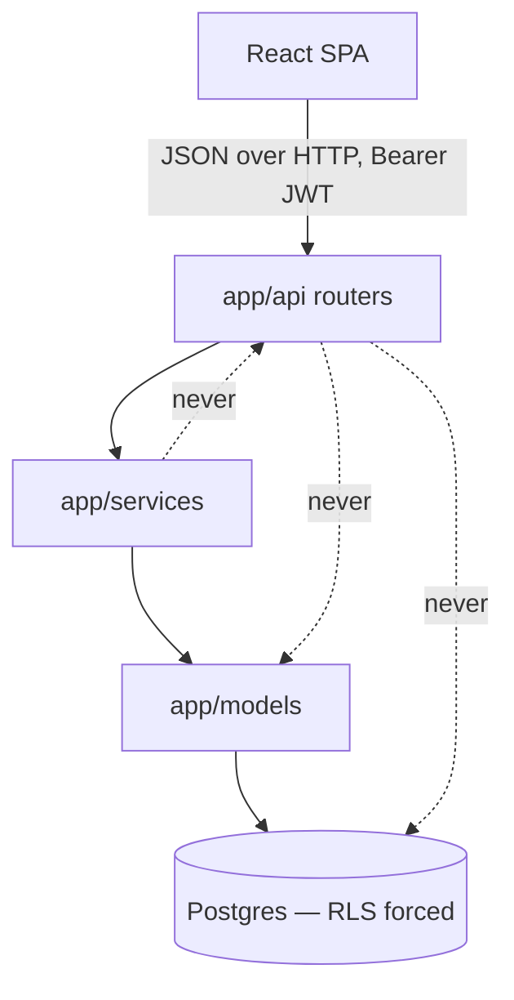
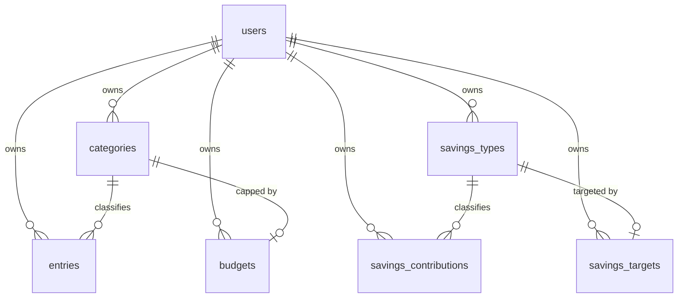
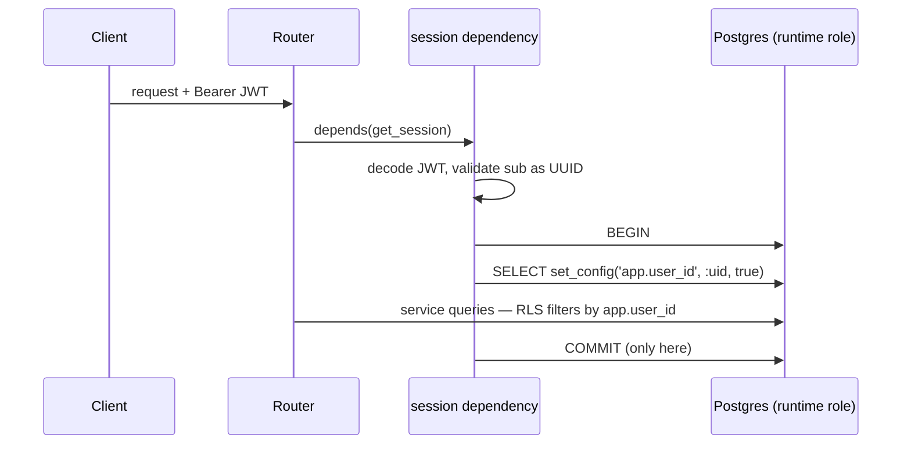
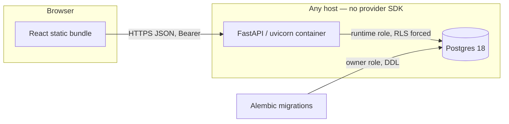

# Architecture Spine — MinimalBudget

## Design Paradigm

Layered service application. Three backend layers, one direction of dependency, plus a database
layer that is not merely storage but the **authority on data isolation**.

| Layer | Package | Owns |
| --- | --- | --- |
| HTTP | `app/api/` | Routing, request/response schemas, status codes. No SQL, no business rules. |
| Service | `app/services/` | Business rules, aggregation queries. |
| Model | `app/models/` | SQLAlchemy ORM entities and their constraints. |
| Database | `migrations/` | Schema, CHECK constraints, grants, and the RLS policies that enforce isolation. |



Dependencies point downward only. A router may not import a model; a service may not import a
router; nothing below the HTTP layer knows a request exists.

## Invariants & Rules

### AD-1 — Postgres RLS is the isolation authority

- **Binds:** all
- **Prevents:** one slice enforcing tenancy with `WHERE user_id = ?` and another forgetting to,
  producing a cross-user leak that no test of the second slice would catch.
- **Rule:** every user-scoped table carries a non-null `user_id` and has both `ENABLE ROW LEVEL
  SECURITY` and `FORCE ROW LEVEL SECURITY`, with `USING` and `WITH CHECK` policies covering all
  four commands. Application-level `WHERE user_id` filters are defence in depth and are never the
  only thing standing between two users. The obligation is mechanised by AD-24, not left to
  discipline.

### AD-2 — Two database roles, and the runtime role is not the owner

- **Binds:** all
- **Prevents:** the application connecting as the schema owner, which silently bypasses the very
  policies AD-1 installs.
- **Rule:** the owner role owns the schema and runs Alembic migrations. The runtime role has
  `SELECT, INSERT, UPDATE, DELETE` on user-scoped tables, `EXECUTE` on the function named in
  AD-19, no DDL, and no `BYPASSRLS`. `FORCE ROW LEVEL SECURITY` is set so even the owner is
  subject to its own policies. The application connects only as the runtime role.

### AD-3 — Tenancy is established once per request, inside the transaction, through a bound parameter

- **Binds:** all
- **Prevents:** a pooled connection carrying one user's identity into the next user's request; and
  a JWT claim being string-interpolated into SQL because the obvious statement takes no parameter.
- **Rule:** every request opens exactly one transaction and, before any other statement, executes
  `SELECT set_config('app.user_id', :uid, true)` with `:uid` **bound**, never interpolated.
  `SET LOCAL` is forbidden — it accepts no parameter, and a plain `SET` would outlive the
  transaction on a pooled connection. The JWT `sub` claim is parsed and validated as a UUID before
  it reaches this call. Policies read `current_setting('app.user_id', true)`, and every policy
  treats a NULL or unset setting as matching nothing.

### AD-4 — Sessions come from one dependency, and only that dependency commits

- **Binds:** all
- **Prevents:** a route obtaining a raw session that skips AD-3 and therefore sees every user's
  rows; and a mid-request `commit()` silently discarding the transaction-local setting, after which
  every subsequent query returns zero rows and the endpoint answers `200` with empty data instead
  of failing.
- **Rule:** request-scoped database access is available only through the FastAPI dependency that
  opens the transaction, sets the setting, and commits or rolls back at the end. No module
  constructs a `Session` or connection at request time, and **no service or router calls `commit()`
  or `begin()`**. Migrations, the seed script and the test fixtures are the only code permitted
  their own engine.

### AD-5 — Money is `NUMERIC(14,2)`, `Decimal` in Python, a string in JSON

- **Binds:** entries, savings_contributions, budgets, savings_targets, dashboard, client
- **Prevents:** two slices disagreeing on the wire representation, and float rounding turning a sum
  of user data into a wrong number.
- **Rule:** no monetary value is ever a `float` or a JSON number. Columns are `NUMERIC(14,2)`,
  Python values are `decimal.Decimal`, and every monetary field is serialised as a decimal string
  with exactly two places. The client parses these strings; it never does arithmetic on them
  without an explicit decimal helper.

### AD-6 — Direction is carried by `kind`, never by the sign of `amount`

- **Binds:** entries, categories, dashboard
- **Prevents:** one slice storing expenses as negative amounts while another stores them positive,
  making every aggregate ambiguous.
- **Rule:** `amount` has `CHECK (amount > 0)` on every table that holds one. Direction lives in the
  `kind` enum (`income` | `expense`).

### AD-7 — An entry's `kind` must match its category's `kind`

- **Binds:** entries, categories
- **Prevents:** an expense entry filed under an income category, which silently corrupts both the
  budget-vs-actual figures and the income totals.
- **Rule:** `categories` carries a `UNIQUE (user_id, id, kind)`, and `entries` references it with a
  composite foreign key on `(user_id, category_id, kind)` per AD-18. The database rejects the
  mismatch; the service layer is not the only guard.

### AD-8 — Another user's row is 404, and every write proves ownership before answering

- **Binds:** all API routes that take a resource id
- **Prevents:** an attacker enumerating ids and learning which exist from the status code; and a
  blind upsert (`PUT /api/budgets/{category_id}`) answering `201` for a resource id that belongs to
  someone else, because nothing ever read it.
- **Rule:** when RLS returns zero rows for a resource id, the response is `404`. `403` is reserved
  for an authenticated user failing a rule about their *own* data. A write path that does not
  otherwise read the referenced row performs an explicit ownership read first, or relies on the
  composite foreign key of AD-18 to reject it — never on the absence of an error.

### AD-9 — Aggregation happens in SQL, and empty months are explicit zeroes

- **Binds:** dashboard
- **Prevents:** the trend endpoint returning a ragged series whose gaps each client fills
  differently, and per-row Python summation that diverges from the SQL used elsewhere.
- **Rule:** dashboard totals, budget-vs-actual and trends are computed by SQL aggregates. The trend
  series is generated from a `generate_series` of months left-joined to the data, so a month with
  no rows is returned as zero rather than omitted.

### AD-10 — Month filtering is a half-open range on a `DATE` column

- **Binds:** entries, savings_contributions, dashboard
- **Prevents:** the `BETWEEN` off-by-one that double-counts or drops the last day, and timezone
  drift from storing an instant where a calendar date was meant.
- **Rule:** `occurred_on` is `DATE`, not `TIMESTAMP`, is required on write, and has no server-side
  default. A `YYYY-MM` filter becomes `occurred_on >= <first of month> AND occurred_on < <first of
  next month>`.

### AD-11 — Budgets and targets are standing monthly amounts, not per-month rows

- **Binds:** budgets, savings_targets, dashboard
- **Prevents:** half the system treating a budget as "the budget for March" and the other half as
  "the budget", which changes what every dashboard number means.
- **Rule:** exactly one row per `(user, expense category)` and per `(user, savings type)`. They are
  written with `PUT`, which upserts. A per-month override is a v2 concern and arrives as a nullable
  `month` column, not a rewrite.

### AD-12 — Reference data is created by name, idempotently, and only where declared

- **Binds:** categories, savings_types, entries, savings_contributions
- **Prevents:** duplicate `Food` and `food` categories per user; a POST that fails because the user
  typed a category they had not pre-registered; and slice 3 guessing whether contributions
  auto-create savings types the way entries auto-create categories.
- **Rule:** categories are unique per `(user_id, kind, lower(name))`; savings types per
  `(user_id, lower(name))`. An entry payload carries **exactly one** of `category_id` or
  `category_name` — `category_name` creates the category for that user and kind if absent.
  A contribution carries `savings_type_id` only and **never** auto-creates a savings type;
  an unknown type is a `404`. Lookup by name is case-insensitive; the original casing is stored.

### AD-13 — Auth is Argon2id plus a short-lived HS256 JWT, with no refresh flow

- **Binds:** auth, all protected routes
- **Prevents:** each slice inventing its own session mechanism, and a v2 mobile client discovering
  the web client depends on a cookie it cannot use.
- **Rule:** passwords are hashed with Argon2id. The access token is a JWT signed HS256 with the
  user id in `sub`, carried in an `Authorization: Bearer` header. Expiry logs the user out; there
  is no refresh token in v1. The `sub` claim is what becomes `app.user_id` under AD-3.

### AD-14 — The API is a plain JSON HTTP API with no coupling to the web client

- **Binds:** all
- **Prevents:** a v2 Expo client finding server-rendered templates, cookie-only auth, or
  browser-shaped redirects in its way.
- **Rule:** the backend serves JSON only. No templates, no server-side sessions, no
  `Set-Cookie`-based auth. The frontend is a separate static build talking to the API across an
  origin boundary configured by CORS from an environment variable.

### AD-15 — Configuration is environment variables only

- **Binds:** all
- **Prevents:** a provider SDK or a hardcoded host pinning the project to one deploy target.
- **Rule:** every setting is read through one `pydantic-settings` object populated from the
  environment. No cloud provider SDKs. `.env.example` is committed with empty values; `.env` never
  is. No secret has a working default — a missing secret fails startup loudly.

### AD-16 — The frontend calls the API through one typed client module

- **Binds:** slice-5-client, and the v2 Expo client
- **Prevents:** components calling `fetch` directly, so that auth headers, the 401 path and the
  decimal-string convention of AD-5 are re-implemented inconsistently and cannot be lifted into v2.
- **Rule:** all network access goes through `src/api/`. No component or hook calls `fetch`
  directly. Token attachment, the collection envelope of AD-20 and 401 handling live there once.

*AD-17 is retired — it bound a single unit and restated the PRD, failing this spine's own inclusion
test. It now lives as a Consistency Convention (inline SVG charts). The id is retired, never reused.*

### AD-18 — Every foreign key between user-scoped tables carries `user_id`

- **Binds:** all user-scoped tables
- **Prevents:** user B referencing user A's row. **Postgres foreign-key checks always bypass row
  security** — the manual says so explicitly and warns about the covert channel. So a bare
  `category_id` FK lets B create an entry against A's category: B learns the id exists, and A can
  never delete that category again. RLS alone does not close this.
- **Rule:** every FK between two user-scoped tables is composite and includes `user_id` on both
  sides, backed by the matching composite unique key on the referenced table. A single-column FK to
  a user-scoped table is a defect.

### AD-19 — Registration establishes tenancy before it writes; login reads through one
security-definer function

- **Binds:** auth, savings_types
- **Prevents:** the deadlock where registration must seed a new user's default savings types before
  any `app.user_id` exists, and the three obvious unblocks (setting the setting mid-transaction,
  adding `IS NULL OR` to the policy, exempting the table from `FORCE`) each punch a hole that makes
  those tables globally readable. Also prevents the runtime role holding an unpoliced `SELECT` over
  every row of `users`, password hashes included.
- **Rule:** registration generates the user's UUID **in the application**, calls `set_config` per
  AD-3 with that id, and only then inserts the user row and seeds the three default savings types —
  so no write path ever runs outside RLS. `users` is itself RLS-protected on `id =
  app.user_id`. Login cannot read `users` by email under that policy, so it calls a `SECURITY
  DEFINER` function owned by the owner role that takes an email and returns only `(id,
  password_hash)`; the runtime role holds `EXECUTE` on that function and no direct read of `users`.
  No policy anywhere admits a NULL `app.user_id`.

### AD-20 — Collections are enveloped and deterministically ordered

- **Binds:** every list endpoint, slice-5-client
- **Prevents:** slices 2, 3 and 4 each choosing between a bare array and an envelope, and the
  single API client of AD-16 paying for the fork; plus an unstable list order that makes the UI
  reshuffle between identical requests.
- **Rule:** every list endpoint returns `{"items": [...]}` — never a bare array, so a cursor can be
  added later without breaking callers. Every list has an explicit, total `ORDER BY`: dated rows by
  `occurred_on DESC, created_at DESC, id`; reference data by `lower(name), id`. No pagination in
  v1; see Deferred.

### AD-21 — Delete behaviour is fixed per foreign key, in the schema

- **Binds:** categories, savings_types, entries, savings_contributions, budgets, savings_targets
- **Prevents:** two slices independently choosing `CASCADE` or `RESTRICT` for the same
  relationship, so that deleting a category either silently destroys a year of entries or fails,
  depending on which migration landed first.
- **Rule:** `ON DELETE CASCADE` from `users` to everything it owns. `ON DELETE RESTRICT` from
  reference data that transactional rows point at — a category with entries, or a savings type with
  contributions, cannot be deleted, and the API answers `409`. `ON DELETE CASCADE` for the budget
  or target attached to a category or savings type, since it is an attribute of that reference row,
  not an independent record.

### AD-22 — Aggregates never return NULL, and budget-vs-actual is driven from the budget side

- **Binds:** dashboard
- **Prevents:** a `SUM` over no rows serialising as `null` where the client expects a decimal
  string, and a budgeted category with no spending this month either vanishing from the report or
  not, depending on which way a developer wrote the join.
- **Rule:** every SQL aggregate is wrapped in `COALESCE(..., 0)` and serialised per AD-5. Budget
  vs actual is built by `LEFT JOIN` **from** the set of budgeted categories **to** the entries, so
  a budgeted category with zero spend appears at zero; a category with spend and no budget appears
  with a null budget, never omitted. Savings target vs actual follows the same direction.

### AD-23 — Email is normalised on write and unique case-insensitively

- **Binds:** auth
- **Prevents:** `Alex@example.com` and `alex@example.com` registering as two accounts, then one of
  them being unable to log in reliably.
- **Rule:** email is lowercased and trimmed before it is stored or compared, and carries a unique
  index over the normalised value.

### AD-24 — Isolation is proven by execution, per slice, and the schema is audited by a test

- **Binds:** all
- **Prevents:** AD-1 being an obligation nobody enforces — a new table shipping without policies,
  and nothing failing. The brief demands isolation be proven by running queries as a second user,
  not by reading the policy.
- **Rule:** every slice that adds a user-scoped table ships a test that connects **as the runtime
  role** with user B's context and asserts zero rows of user A's data on read and refusal on
  insert, update and delete. One schema test enumerates every table carrying a `user_id` column and
  fails if it lacks `rowsecurity`, `forcerowsecurity`, or a policy. Tests run against real
  Postgres; there is no SQLite path, because SQLite has no row-level security and would make these
  assertions meaningless.

## Consistency Conventions

| Concern | Convention |
| --- | --- |
| Naming — tables, columns | `snake_case`, plural tables (`entries`), singular FK columns (`category_id`). |
| Naming — Python | Modules `snake_case`, ORM classes singular `PascalCase` (`Entry`), Pydantic schemas suffixed by role (`EntryCreate`, `EntryOut`). |
| Naming — API | Plural nouns under `/api`, e.g. `/api/entries`, `/api/savings/types`. |
| Naming — React | Components `PascalCase.tsx`, hooks `useThing.ts`, one component per file. |
| Ids | `uuid` primary keys. Generated in the application for `users` (AD-19), by `gen_random_uuid()` elsewhere. No sequential integers in URLs. |
| Dates | Calendar facts are `DATE` (`occurred_on`). Audit stamps are `TIMESTAMPTZ` (`created_at`). Month parameters are `YYYY-MM` strings. |
| Money on the wire | Decimal strings, always two places: `"1250.00"`. |
| Error shape | `{"detail": "<message>"}` — FastAPI's default, used uniformly. Validation errors keep FastAPI's 422 body. |
| Errors — status | 401 unauthenticated · 403 authenticated but forbidden on own data · 404 missing *or* another user's · 409 uniqueness or `RESTRICT` conflict · 422 validation. |
| Mutation | State changes only through service functions, inside the one request transaction (AD-4). No ORM writes from a router. |
| Config | Read from the settings object, never `os.environ` at a call site. |
| Auth coverage | Every router except `/api/auth/register`, `/api/auth/login` and `/health` depends on the current-user dependency. |
| Charts | Hand-rolled inline SVG components under `frontend/src/charts/`. No chart library in v1. |
| Logging | Standard library `logging`, one logger per module. Never log a request body, a token, a password or an email. |

## Stack

Verified live on 2026-08-29 against PyPI, the npm registry and Docker Hub.

| Name | Version |
| --- | --- |
| Python | 3.13 |
| fastapi | 0.141.1 |
| uvicorn | 0.52.4 |
| sqlalchemy | 2.0.52 |
| alembic | 1.19.1 |
| psycopg[binary] | 3.3.4 |
| pydantic | 2.13.5 |
| pydantic-settings | 2.15.0 |
| argon2-cffi | 25.1.0 |
| pyjwt | 2.13.0 |
| pytest | 9.1.1 |
| httpx | 0.28.1 |
| ruff | 0.16.5 |
| postgres (image) | 18-alpine |
| node | 22.23.2 |
| react / react-dom | 19.2.8 |
| vite | 8.2.2 |
| @vitejs/plugin-react | 6.1.1 |
| vitest | 4.1.11 |
| react-router-dom | 7.18.3 |
| @testing-library/react | 16.3.3 |
| jsdom | 30.0.1 |

Node 22 and Python 3.13 are the installed workspace toolchain and lag the current Active LTS
(Node 24) and current Python (3.14). Held deliberately so this project matches the rest of the
workspace; see Deferred. TypeScript is pinned by a real `tsc` and `vite build` run in the client
slice, not asserted here — `7.0.2` is the first candidate, latest 5.x the fallback.

## Structural Seed

### Core entities



Every entity except `users` carries `user_id`, is governed by AD-1, and every relationship drawn
here is a composite foreign key including `user_id` per AD-18.

### Request path — where tenancy is established



### Deployment and environments



Three environments, one shape. **Local** is `docker compose` — Postgres plus the API, with the
frontend on the Vite dev server proxying `/api`. **Test** is that same Postgres on a throwaway
database created and dropped per run, exercised as the runtime role so AD-24's assertions mean
something. **Production** is the same two containers behind whatever TLS terminator the host
provides, configured entirely by environment variables. Migrations run as a separate step with the
owner credentials before the API starts; the API image never carries owner credentials.

### Source tree

```text
moneymap/
  docker-compose.yml     # postgres + api, local and test
  backend/
    app/
      api/               # routers, one module per resource
      services/          # business rules and aggregation queries
      models/            # SQLAlchemy entities
      schemas/           # pydantic request/response models
      core/              # settings, security, session dependency (AD-3, AD-4)
      main.py
    migrations/          # alembic; owns RLS policies, grants, the AD-19 function
    tests/
  frontend/
    src/
      api/               # the single typed client (AD-16)
      components/
      pages/
      charts/            # inline SVG
  docs/
```

## Capability → Architecture Map

| Capability / Area | Lives in | Governed by |
| --- | --- | --- |
| Registration, login, current user | `api/auth.py`, `services/auth.py`, `core/security.py` | AD-13, AD-19, AD-23, AD-15 |
| Per-user isolation | `migrations/` policies, `core/db.py` | AD-1, AD-2, AD-3, AD-4, AD-8, AD-18, AD-24 |
| Categories | `api/categories.py`, `services/categories.py` | AD-6, AD-7, AD-12, AD-20, AD-21 |
| Income and expense entries | `api/entries.py`, `services/entries.py` | AD-5, AD-6, AD-7, AD-10, AD-12, AD-18, AD-20 |
| Savings types and contributions | `api/savings.py`, `services/savings.py` | AD-5, AD-10, AD-12, AD-20, AD-21 |
| Budgets and savings targets | `api/budgets.py`, `api/savings.py` | AD-5, AD-8, AD-11, AD-18, AD-21 |
| Dashboard summary and trends | `api/dashboard.py`, `services/dashboard.py` | AD-9, AD-10, AD-5, AD-22 |
| React client | `frontend/src/` | AD-5, AD-16, AD-20 |
| Test strategy | `backend/tests/` | AD-24 |

## Deferred

- **TypeScript major version.** Settled by a real build in the client slice. `7.0.2` is the first
  candidate — note it ships no importable programmatic API before 7.1, which affects library
  consumers but not `tsc` or `vite build`. Fallback is the latest 5.x. Deferred because asserting a
  major version's toolchain compatibility without running it is exactly the failure this project
  should not repeat.
- **Node 24 / Python 3.14.** Both are current; both are deliberately not adopted so this project
  matches the installed workspace toolchain. Revisit when the workspace upgrades, together.
- **Pagination.** Not needed at single-user data volumes. AD-20's envelope makes adding a cursor
  additive, so this deferral cannot cause divergence.
- **Rate limiting and lockout on login.** Not needed for a tracker with no public signup pressure
  in v1; revisit before the instance is exposed to the public internet.
- **Refresh tokens, password reset, email verification.** Named out of scope by the brief. Revisit
  when the v2 mobile client makes short expiry painful.
- **Per-month budget overrides.** AD-11 fixes the v1 meaning; the schema takes a nullable `month`
  column later without a rewrite.
- **Connection pool sizing and read replicas.** No load justifies tuning them; defaults stand until
  a measurement says otherwise.
- **CI/CD pipeline and the specific host.** Deliberately undecided — AD-15 keeps every host
  reachable. Revisit at deploy time.
- **Observability beyond stdlib logging.** No metrics or tracing stack in v1; the deployment has
  one API container.
